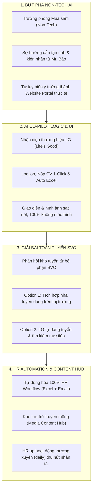

# EXECUTIVE SLIDE: DỰ ÁN PORTAL TUYỂN DỤNG LG HANOI
## 🤖 BÀI HỌC ỨNG DỤNG AI & HÀNH TRÌNH TỪ Ý TƯỞNG ĐẾN THỰC THI

> **Chủ đề Slide**: *Hành trình một Trưởng phòng Mua sắm (Non-Tech) ứng dụng AI Co-pilot biến ý tưởng thành sản phẩm thực tế – Bài học lan tỏa tinh thần chủ động đổi mới.*  
> **Live Web Portal**: [https://emsaunguyen-ship-it.github.io/Tuyen-Dung-LG-Hanoi/?v=12](https://emsaunguyen-ship-it.github.io/Tuyen-Dung-LG-Hanoi/?v=12)

---

## 🎯 Lead Strategic Title (Thông Điệp Lan Tỏa)
> **"Từ Ý Tưởng Đến Sản Phẩm Thực Tế Trong Vài Giờ: AI Không Thay Thế Con Người – AI Chắp Cánh Cho Những Người Không Chuyên Biến Ý Tưởng Thành Hiện Thực."**

---

## 📐 Slide Architecture (Cấu Trúc 4 Khối Trực Quan 2x2 Grid)

---

## 📊 Detailed Executive Layout Grid (Cấu Trúc 4 Thẻ Slide Chi Tiết)

| Thẻ 1: NON-TECH AI BREAKTHROUGH | Thẻ 2: AI LOGIC & UI DESIGN | Thẻ 3: GIẢI BÀI TOÁN TUYỂN SVC | Thẻ 4: HR AUTOMATION & MEDIA HUB |
| :--- | :--- | :--- | :--- |
| **• Vượt qua rào cản kỹ thuật:** Là Trưởng phòng Mua sắm (không chuyên IT), trước đây việc tạo Web tưởng như bất khả thi. | **• Logic & Giao diện chuẩn LG:** Cùng AI lập trình logic lọc công việc, 1-click apply, xuất báo cáo Excel cộng dồn. | **• Xuất phát từ Complain của SVC:** SVC phản hồi không tuyển được người theo kênh truyền thống. | **• Tự động hóa 100% HR:** Tự động tổng hợp file Excel cộng dồn, gửi email thông báo cho HR Manager. |
| **• Sự đồng hành từ Mr. Bảo:** Nhờ sự tận tình và kiên nhẫn của **Mr. Bảo (người hướng dẫn lớp)**, tôi đã vượt rào cản để tự thực thi. | **• Chuẩn hình ảnh 1:1 không méo:** Tinh chỉnh tỷ lệ khung hình chuẩn, hình ảnh sắc nét, trực quan sinh động. | **• Option 1 (Thị trường):** Thêm các nhà tuyển dụng khác trên thị trường để mở rộng nguồn ứng viên. | **• Kho hoạt động doanh nghiệp:** Xây dựng Media Content Hub để HR đăng tải thường xuyên (daily) các hoạt động công ty. |
| **• Tự làm sản phẩm mẫu (Live URL):** Rút ngắn thời gian từ ý tưởng trên giấy đến website hoạt động thực tế. | **• Trải nghiệm tương tác trực tiếp:** Nhấp/chạm vào bất kỳ ảnh minh họa nào để chuyển ngay tới trang Web live. | **• Option 2 (LG Tự tìm kiếm):** LG tự chủ động đăng tuyển & tìm kiếm trực tiếp để tăng uy tín & sự tin cậy. | **• Thu hút nhân tài đỉnh cao:** Thể hiện văn hóa làm việc dynamic, thúc đẩy thương hiệu tuyển dụng LG. |

---

## 💡 3 Bài Học Cốt Lõi Từ Dự Án (Key Takeaways)

1. **Người Hướng Dẫn & AI Chắp Cánh:** Kết hợp sự kiên nhẫn từ người hướng dẫn (Mr. Bảo) cùng năng lực thực thi của AI giúp người không chuyên bứt phá rào cản.
2. **Giải Quyết Bài Toán Thực Tế Với Các Options Linh Hoạt:** Luôn xuất phát từ điểm nghẽn thực sự (SVC hiring pain point) và đưa ra nhiều giải pháp chiến lược (Market Aggregation + Direct LG Sourcing).
3. **Mỗi Nhân Sự Là Một Innovator Số Hóa:** Tự động hóa quy trình (HR Automation) và chủ động xây dựng kho nội dung truyền thông để thu hút nhân tài liên tục.

